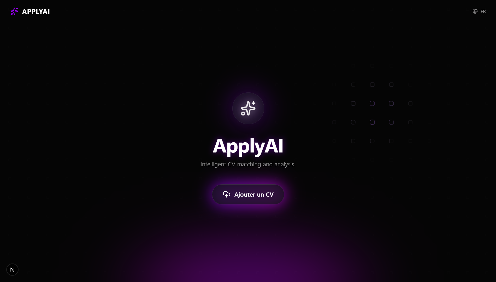

# 🚀 ApplyAI - Demo Mode

<div align="center">


**An intelligent CV matching and analysis platform — Modern, Fast, and Fully Mocked.**

</div>

Welcome to the **ApplyAI** demonstration repository. This is a standalone, self-contained version of the ApplyAI frontend, designed to showcase the platform's features without requiring a live backend API.



## ✨ Features

-   **Intelligent CV Analysis**: Experience the workflow of uploading a CV and getting an instant matching score.
-   **Job Search Simulation**: Browse realistic job listings sourced from generic recruitment channels in fully mocked demo mode.
-   **Live Match Scoring**: Visualize compatibility scores, matched skills, and identified missing skills.
-   **AI Cover Letter Generation**: See the type of high-quality, personalized cover letters ApplyAI can generate.
-   **Glassmorphic Design**: A premium, modern UI with support for both Dark and Light modes.
-   **Multilingual Support**: Fully translated in French and English.

## 🛠️ Performance & Tech Stack

This demo is built using modern web technologies:
-   **Framework**: [Next.js](https://nextjs.org/) (App Router)
-   **Styling**: [Tailwind CSS](https://tailwindcss.com/)
-   **Animations**: [Framer Motion](https://www.framer.com/motion/)
-   **Icons**: [Lucide React](https://lucide.dev/)
-   **Mock Data**: Powered by a local `public/mock-data.json` file for easy customization.

## 💻 Local Development

To run this demo locally:

```bash
# Install dependencies
npm install

# Run the development server
npm run dev
```

Open [http://localhost:3000](http://localhost:3000) with your browser to see the result.

## 📝 Demo Mode Note

Every feature in this repository is **zero-friction**. 
-   **Direct Access**: The "Try Demo" button bypasses the upload step for an instant experience.
-   **Instant Actions**: "Analyze" and "Search" buttons work immediately without requiring any form input or file selection.
-   **Pre-defined Results**: All "AI" responses are pre-defined in `public/mock-data.json` to ensure a smooth and consistent demonstration experience.

---
